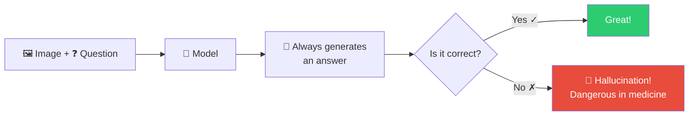
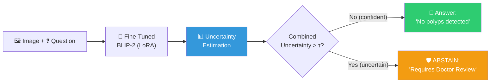
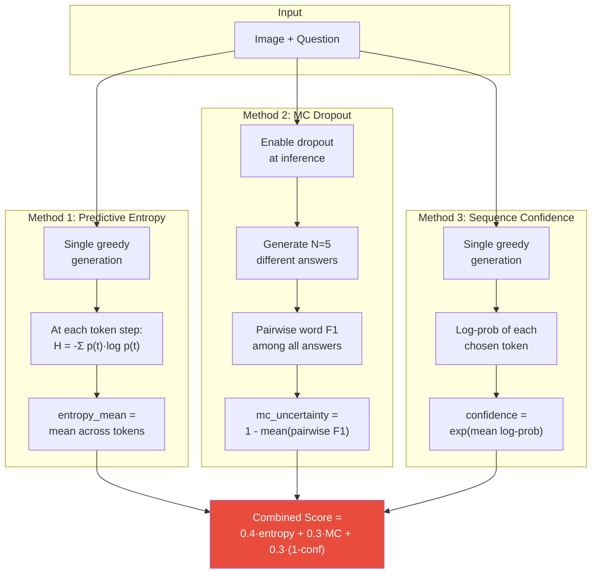
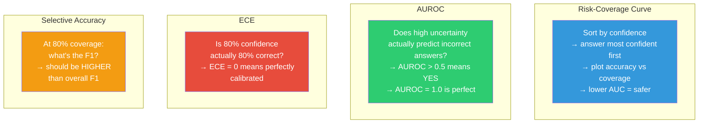
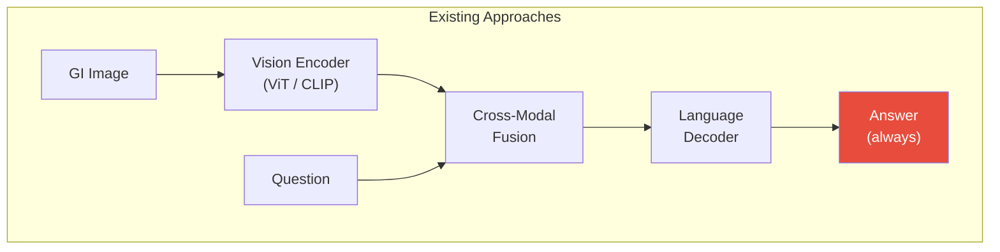
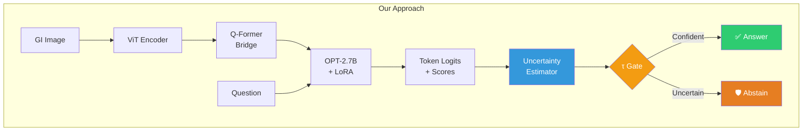
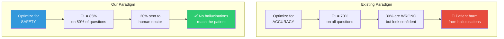

# What is the Novelty of Your Project?

## One-Line Answer

> **We are the first to implement uncertainty-aware selective prediction (abstention) for Medical VQA on the Kvasir-VQA-x1 dataset — the model knows *when it doesn't know* and refuses to answer rather than hallucinating.**

---

## The Core Problem

Every existing approach on the Kvasir-VQA-x1 dataset (and most medical VQA systems) follows this pattern:



The model **always answers**, even when it has no idea — leading to dangerous hallucinations like:
- Identifying a "urethral sphincter" in a GI endoscopy image (wrong organ system)
- Claiming "all polyps removed" when polyps are still present (missed diagnosis)

## Our Novel Approach

Our system adds an **uncertainty gate** between the model and the clinician:



---

## Novel Contribution 1: Three-Method Uncertainty Estimation

No existing work on Kvasir-VQA-x1 estimates uncertainty. We implement **three complementary methods** and combine them:



### Algorithm: Combined Uncertainty Estimation

```
ALGORITHM: UncertaintyEstimation(model, image, question)
─────────────────────────────────────────────────────────
Input:  Fine-tuned BLIP-2 model, GI endoscopy image, clinical question
Output: Prediction string, combined uncertainty score ∈ [0, 1]

1. PREDICTIVE ENTROPY:
   │  Generate answer greedily with output_scores=True
   │  For each generation step t:
   │     probs_t ← Softmax(logits_t)
   │     H_t ← -Σ_v  probs_t[v] · log(probs_t[v])
   │  entropy_mean ← mean(H_1, H_2, ..., H_T)
   │  entropy_normalized ← min(entropy_mean / 10, 1.0)

2. MC DROPOUT (N=5 passes):
   │  Enable all Dropout layers in OPT backbone
   │  For i = 1 to N:
   │     answer_i ← model.generate(image, question)
   │  Disable Dropout layers
   │  For each pair (i, j):
   │     f1_{i,j} ← WordF1(answer_i, answer_j)
   │  mc_uncertainty ← 1 - mean(all pairwise f1)

3. SEQUENCE CONFIDENCE:
   │  Generate answer greedily with output_scores=True
   │  For each generated token t:
   │     lp_t ← log(probs_t[chosen_token_t])
   │  confidence ← exp(mean(lp_1, ..., lp_T))     // ∈ [0, 1]
   │  conf_uncertainty ← 1 - confidence

4. COMBINED:
   │  uncertainty ← 0.4·entropy_normalized + 0.3·mc_uncertainty + 0.3·conf_uncertainty

RETURN (majority_answer, uncertainty)
```

---

## Novel Contribution 2: Abstention Mechanism for Medical VQA

### Algorithm: Selective Prediction with Abstention

```
ALGORITHM: SelectivePrediction(predictions, uncertainties, τ)
─────────────────────────────────────────────────────────────
Input:  List of predictions, their uncertainty scores, threshold τ
Output: Safe predictions (with abstentions)

For each (prediction_i, uncertainty_i):
   IF uncertainty_i > τ:
      output_i ← "I am not confident enough to answer. 
                   Please consult a medical professional."
      status_i ← ABSTAINED
   ELSE:
      output_i ← prediction_i
      status_i ← ANSWERED

THRESHOLD TUNING (on validation set):
   For τ in linspace(min_uncertainty, max_uncertainty, 100):
      coverage ← fraction of samples where uncertainty ≤ τ
      selective_f1 ← mean F1 on answered samples only
      IF coverage ≥ 0.80 AND selective_f1 > best_f1:
         optimal_τ ← τ
```

### Why 80% Coverage?

At 80% coverage, the model answers 80% of questions (the ones it's most confident about) and sends 20% to a human doctor. This means:
- **Answered questions**: Higher accuracy than answering everything
- **Abstained questions**: Prevented hallucinations that could harm patients
- **Net effect**: Safer clinical decision support

---

## Novel Contribution 3: Safety-First Evaluation Framework

### Standard vs. Our Evaluation

| Aspect | Standard Evaluation | Our Safety Evaluation |
|--------|--------------------|-----------------------|
| **Core question** | "How accurate is the model?" | "How **safe** is the model?" |
| **Primary metric** | Accuracy, F1, BLEU | Risk-Coverage AUC, AUROC |
| **Failure handling** | Count errors, move on | Analyze *why* failures happen, *prevent* them |
| **Confidence** | Not measured | ECE — is confidence calibrated? |
| **Abstention** | Not an option | Selective prediction — decline when unsure |
| **Clinical safety** | Not addressed | "I don't know" > wrong answer |

### Safety Metrics We Introduce



---

## Comparison with Existing Literature

### Gap Analysis: What exists vs. What we add

| Feature | PaliGemma 2<br/>(Medico 2025) | Fine-tuned<br/>PaliGemma 3B | Florence<br/>Model | Disease-Guided<br/>VQA | BLIP-2<br/>Zero-Shot | **Ours** |
|---------|:---:|:---:|:---:|:---:|:---:|:---:|
| Domain fine-tuning | ✅ LoRA | ✅ LoRA | ✅ | ✅ | ❌ | ✅ LoRA |
| Quantization | — | 4-bit | — | — | — | **8-bit** |
| Uncertainty estimation | ❌ | ❌ | ❌ | ❌ | ❌ | **✅ 3 methods** |
| MC Dropout | ❌ | ❌ | ❌ | ❌ | ❌ | **✅ 5-pass** |
| Predictive Entropy | ❌ | ❌ | ❌ | ❌ | ❌ | **✅** |
| Abstention mechanism | ❌ | ❌ | ❌ | ❌ | ❌ | **✅** |
| Risk-Coverage eval | ❌ | ❌ | ❌ | ❌ | ❌ | **✅** |
| AUROC of uncertainty | ❌ | ❌ | ❌ | ❌ | ❌ | **✅** |
| ECE (calibration) | ❌ | ❌ | ❌ | ❌ | ❌ | **✅** |
| Complexity-stratified analysis | Partial | Partial | ❌ | ✅ | ❌ | **✅** |
| Hallucination analysis | ❌ | ❌ | ❌ | ❌ | ❌ | **✅** |
| Selective accuracy | ❌ | ❌ | ❌ | ❌ | ❌ | **✅** |

> [!IMPORTANT]
> **Every cell marked ✅ in the "Ours" column but ❌ in all other columns represents a novelty.** No existing work on Kvasir-VQA-x1 implements uncertainty estimation, abstention, or safety-first evaluation.

### Metric Comparison (Kvasir-VQA-x1 Results)

| Model | EM | Word F1 | BLEU-1 | ROUGE-L | METEOR | Safety? |
|-------|:---:|:---:|:---:|:---:|:---:|:---:|
| BLIP-2 zero-shot (our baseline) | 0.0% | 23.4% | 19.5% | 20.8% | 21.8% | ❌ |
| BLIP-2 + LoRA (ours, 500 samples) | 5.0% | 49.6% | — | — | — | ❌ |
| BLIP-2 + LoRA + Uncertainty (**ours**) | — | **↑ selective F1** | — | — | — | **✅** |
| PaliGemma 2 (Medico 2025) | — | — | 42.7% | — | 66.0% | ❌ |
| Fine-tuned PaliGemma 3B | — | — | — | 72.3%* | 70.0%* | ❌ |
| Florence | — | — | 16.0% | 88.0%* | 49.0% | ❌ |

*\* Different test sets, not directly comparable*

---

## Architectural Difference: Standard vs. Ours

### Standard Medical VQA Pipeline (All Existing Work)



### Our Uncertainty-Aware Pipeline



The key architectural addition is the **Uncertainty Estimator + τ Gate** between the language decoder output and the final answer. This component:
1. Reads the softmax distributions at each generation step (entropy)
2. Runs multiple stochastic passes (MC Dropout)
3. Computes sequence-level confidence (log-prob)
4. Combines them into a single uncertainty score
5. Compares against threshold τ to decide answer vs. abstain

---

## The Paradigm Shift



> **In medicine, saying "I don't know" is always safer than confidently guessing wrong.**

---

## Summary: Three Novelties

| # | Novelty | What It Does | Why It Matters |
|---|---------|-------------|----------------|
| 1 | **Multi-method uncertainty estimation** | Combines predictive entropy, MC Dropout, and log-prob confidence into a single score | No existing Kvasir-VQA-x1 work quantifies model uncertainty |
| 2 | **Threshold-based abstention** | Model refuses to answer when uncertainty > τ | Prevents hallucinations from reaching clinicians |
| 3 | **Safety-first evaluation framework** | Risk-Coverage, AUROC, ECE, selective accuracy | Shifts evaluation from "how accurate?" to "how safe?" |

These three contributions together make the system **clinically deployable** — not just academically interesting. A model that knows its limits is fundamentally safer than one that always guesses.
